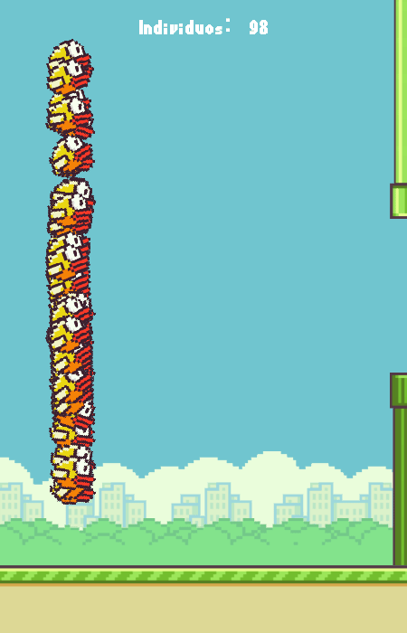

# Flappy Bird com Inteligência Artificial (NEAT)

<br>

<div>
  
  
</div>

---

## Sobre o Projeto

Este projeto apresenta duas versões do clássico jogo Flappy Bird, desenvolvido em Python com a biblioteca Pygame:

1.  **Versão Clássica:** Uma cópia fiel do jogo original, onde o jogador controla o pássaro manualmente.
2.  **Versão com IA:** Uma implementação de uma rede neural que aprende a jogar o jogo sozinha através do algoritmo de neuroevolução **NEAT** (NeuroEvolution of Augmenting Topologies).

O objetivo principal foi não apenas recriar o jogo, mas também explorar como um algoritmo genético pode ser treinado para dominar uma tarefa complexa a partir de entradas simples, como a posição do pássaro e dos canos.

### Funcionalidades

#### Jogo Original
- Movimento de pulo do pássaro e física de gravidade.
- Geração procedural de canos com vãos aleatórios.
- Sistema de pontuação em tempo real.
- Detecção de colisão com os canos e limites da tela.
- Efeito de parallax com múltiplos planos de fundo (chão, árvores, prédios, nuvens).

#### Inteligência Artificial (NEAT)
- **Aprendizagem Autônoma:** A IA aprende do zero, sem conhecimento prévio do jogo.
- **Visualização do Treinamento:** Acompanhe em tempo real as gerações de "pássaros" aprendendo a jogar.
- **Rede Neural:** Utiliza o algoritmo NEAT para otimizar a topologia da rede neural e seus pesos.
- **Fitness Score:** Os pássaros são avaliados com base em quão longe conseguem ir, incentivando a sobrevivência.

### Tecnologias Utilizadas

- **Linguagem:** Python
- **Biblioteca Gráfica:** Pygame
- **IA/Neuroevolução:** NEAT-Python

---

## 🚀 Como Executar

Siga os passos abaixo para rodar tanto a versão manual quanto a simulação da IA.

```bash
# 1. Clone o repositório
git clone https://github.com/henry-mesquita/flappy_bird.git

# 2. Navegue até a pasta do projeto
cd flappy_bird

# 3. (Recomendado) Crie e ative um ambiente virtual
python -m venv venv
# No Linux/macOS:
source venv/bin/activate
# No Windows:
venv\Scripts\activate

# 4. Instale as dependências
pip install -r requirements.txt
```

### ▶️ Jogando a Versão Manual

Para jogar o Flappy Bird manualmente, execute o arquivo `main.py`:

```bash
python main.py
```
**Controles:**
- **Barra de Espaço** ou **Seta para Cima**: Faz o pássaro pular.

### 🧠 Rodando a Simulação da IA

Para iniciar o treinamento da rede neural NEAT, execute o arquivo `neat_ai.py`:

```bash
python neat_ai.py
```
A janela do Pygame abrirá e você verá múltiplas gerações de pássaros tentando passar pelos canos. O console mostrará as estatísticas de cada geração.

---

---

## Créditos e Inspiração

Este projeto foi fortemente inspirado pelo código original em C++ desenvolvido por **Victor Dias** do canal **Universo Programado**. O código foi adaptado e reescrito em Python, com a adição posterior da inteligência artificial usando NEAT.

- **Vídeo de inspiração (Jogo Base):** [Aqui](https://www.youtube.com/watch?v=A3-UQtUSTPs)

---

## Autor

Desenvolvido por **Henry Mesquita**.
